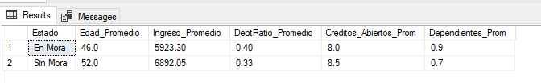
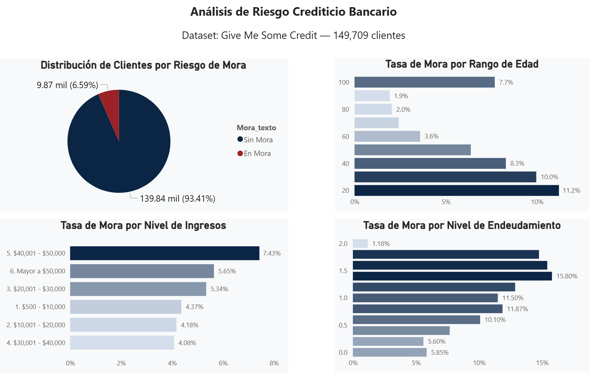
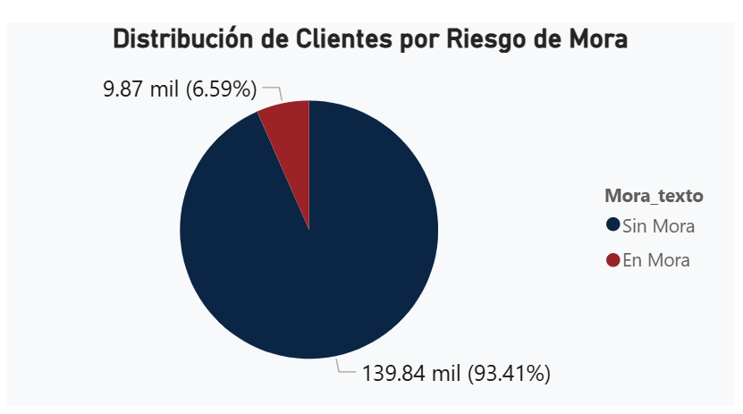
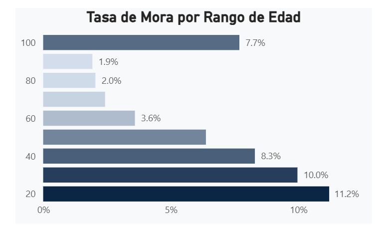
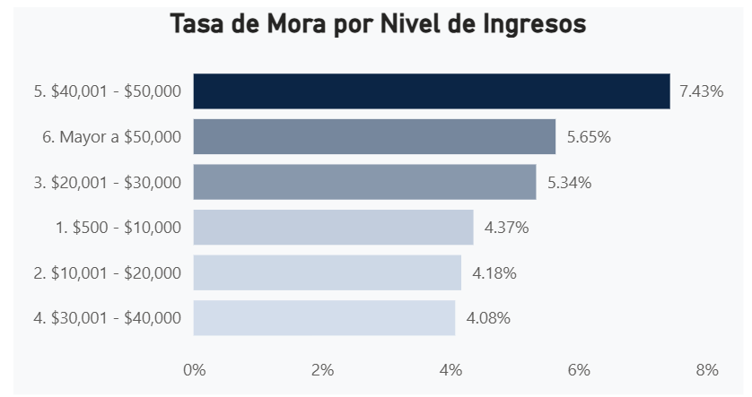
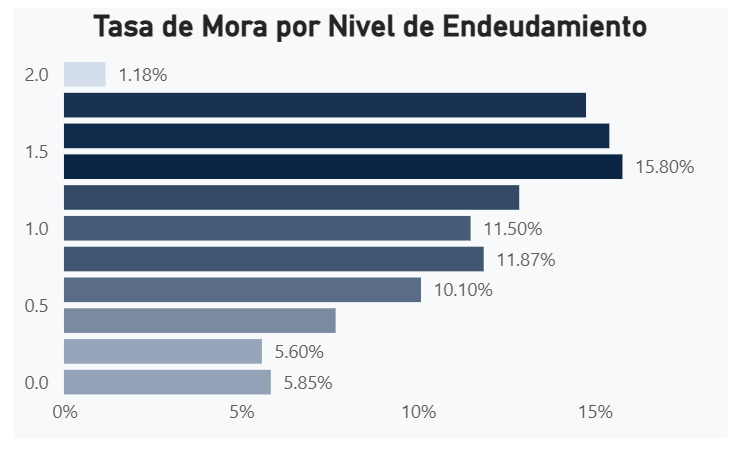

#  Análisis de Riesgo Crediticio Bancario

Este es uno de mis primeros proyectos de análisis de datos. La idea fue tomar un dataset real de clientes bancarios y tratar de entender qué perfil de persona tiene más probabilidad de no pagar su crédito.

No usé Python para este proyecto — lo hice con Excel, SQL Server y Power BI, que son las herramientas que más se piden en el mercado laboral para roles de Data Analyst.

## ¿Qué pregunta intenta responder este proyecto?

> **¿Qué características tiene un cliente que entra en mora bancaria?**

Esa fue la pregunta central. A partir de ahí analicé variables como la edad, los ingresos, el nivel de deuda y el historial de atrasos para encontrar patrones.

---

## Dataset

- **Nombre:** Give Me Some Credit
- **Fuente:** [Kaggle](https://www.kaggle.com/c/GiveMeSomeCredit)
- **Registros originales:** 150,000 clientes
- **Registros después de limpieza:** 149,709 clientes
- **Variable objetivo:** `SeriousDlqin2yrs` (1 = entró en mora, 0 = no entró en mora)

---

## Herramientas usadas

| Herramienta | Para qué la usé |
|---|---|
| **Excel** | Limpieza de datos, tablas dinámicas y gráficos |
| **SQL Server** | Consultas para análisis de patrones |
| **Power BI** | Dashboard interactivo con visualizaciones |

---

## Limpieza de datos

Esta fue la parte más larga pero también la más importante. El dataset tenía varios problemas que tuve que resolver:

- **MonthlyIncome:** tenía valores N/A, ceros y números como 1 o 10 que no son ingresos reales para un titular de crédito en EE.UU. Los reemplacé con el promedio de los valores válidos (mayores a $500).
- **DebtRatio:** tenía valores absurdamente altos (hasta 5,670) causados por ingresos mal registrados. Reemplacé todo lo mayor a 2 con el promedio.
- **RevolvingUtilizationOfUnsecuredLines:** misma situación — valores hasta 8,400 que son imposibles para un porcentaje de uso de crédito. Reemplacé los mayores a 2 con el promedio.
- **Columnas de atrasos:** tenían códigos de error 96 y 98 documentados en Kaggle, y valores mayores a 10 que son prácticamente imposibles. Eliminé esas filas.
- **Age:** eliminé los registros con edad = 0.
- **NumberOfDependents:** los N/A los interpreté como 0 dependientes, que es el valor más conservador.

En total eliminé solo el **0.19% de los registros** — conservé el 99.8% del dataset.

---

## Análisis — lo que encontré

### 1. Distribución general de mora
El dataset está bastante desbalanceado — solo el **6.59% de los clientes** entró en mora. Eso es típico en datasets de crédito real.

### 2. Mora por edad
Los clientes más jóvenes (21-30 años) tienen la mayor tasa de mora con un **11.2%**, mientras que los adultos mayores de 60+ años son los más confiables con tasas de 2-3%.

### 3. Mora por nivel de ingresos
Algo interesante que encontré: el segmento de ingresos más altos ($40,001-$50,000) tiene una tasa de mora de **7.43%**, más alta que segmentos de ingresos medios. Eso va contra la intuición — tener ingresos altos no garantiza responsabilidad crediticia.

### 4. Mora por nivel de endeudamiento (DebtRatio)
Acá sí se cumple la lógica: a mayor DebtRatio, mayor mora. El segmento con DebtRatio entre 1.4 y 1.6 tiene la tasa más alta con **15.8%**.

### 5. Perfil del cliente en mora vs. sin mora

| Característica | Sin Mora | En Mora |
|---|---|---|
| Edad promedio | ~53 años | ~46 años |
| Ingreso promedio | Mayor | Menor |
| DebtRatio promedio | Menor | Mayor |
| Créditos abiertos | Menos | Más |

---

## 💻 Consultas SQL principales

El archivo `RiesgoCrediticio.sql` tiene 5 consultas documentadas:

1. Distribución general de mora
2. Tasa de mora por rango de edad
3. Tasa de mora por nivel de ingresos
4. Tasa de mora por nivel de deuda
5. Perfil comparativo del cliente en mora vs. sin mora

---

## 📈 Dashboard Power BI

El archivo `.pbix` tiene un dashboard interactivo con 4 visualizaciones y un filtro que permite segmentar entre clientes en mora y sin mora.

### Vista general del dashboard

### Distribución de clientes por riesgo de mora

### Tasa de mora por rango de edad

### Tasa de mora por nivel de ingresos

### Tasa de mora por nivel de endeudamiento

---

## Conclusiones

- Los clientes jóvenes y con alto nivel de endeudamiento son el perfil de mayor riesgo
- El ingreso alto no garantiza buen comportamiento crediticio
- El historial de atrasos previos es el indicador más directo de riesgo futuro
- El dataset está desbalanceado (93% vs 7%) — algo importante a considerar si se quisiera hacer un modelo predictivo

---

## Sobre mí

Soy Abraham Giovanni Sanchez Cruces, egresado de Ingeniería de Sistemas Computacionales de la Universidad Privada del Norte. Este es uno de los proyectos con los que estoy construyendo mi portafolio en Data Analytics.

Correo: abrahamgiovannisc@gmail.com  
[LinkedIn](https://www.linkedin.com/in/abraham-giovanni-sanchez-cruces-7538162a2/)

---

*Si tienes algún feedback sobre el proyecto, será bien recibido. Siempre estoy aprendiendo.*
